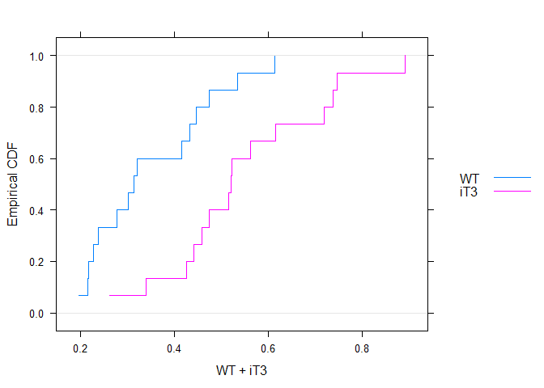

Introduction
============

Myosin XI-I is an unique member of the myosin XI family of unconventional molecular motor proteins in the flowering plant *Arabidopis thaliana*. XI-I is a nucleocytoplasmic linker, connecting the outer nuclear envelope to the actin cytoskeleton. The *xi-i* insertional knockout line *xi-iT3* exhibits a defective nuclear phenotype, with rounded, invaginated nuclei easily visible in root hair cells The circularity indices of nuclei in 4 DAG (days after germination) wild-type and *iT3* seedlings were measured using ImageJ. (Note: This is not my real data set, I made this one up)

``` r
nucshape<-read.table('../data/nucdata.txt', header=TRUE)
```

Results
-------

``` r
library(lattice)
library(RColorBrewer)
library(latticeExtra)
knitr::opts_chunk$set(
  fig.path = "../plots/")
```

A cumulative distribution function comparing the two data sets was made in lattice using the following code:

``` r
WT <- nucshape$WT
iT3 <- nucshape$iT3
nucshapeecdf <- ecdfplot(~ WT + iT3, data=nucshape, auto.key=list(space='right'))
print(nucshapeecdf)
```



A Kolmogov-Smirnov test was performed to compare the two distributions

``` r
kstest<-ks.test(WT, iT3, alternative = 'two.sided')
print(kstest)
```

    ## 
    ##  Two-sample Kolmogorov-Smirnov test
    ## 
    ## data:  WT and iT3
    ## D = 0.53333, p-value = 0.02625
    ## alternative hypothesis: two-sided

A p-value of

    ## [1] 0.02624849

suggests that there is a significant difference between these two distributions.
\#\#Discussion iT3 nuclei appear to generally be rounder(i.e. have a higher circularity index) than wild-type nuclei. This suggests that myosin XI-I plays a role in maintaining proper nuclear shape in *Arabidopsis*
