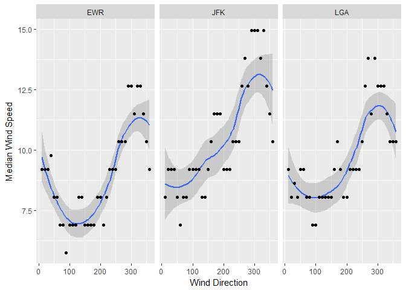
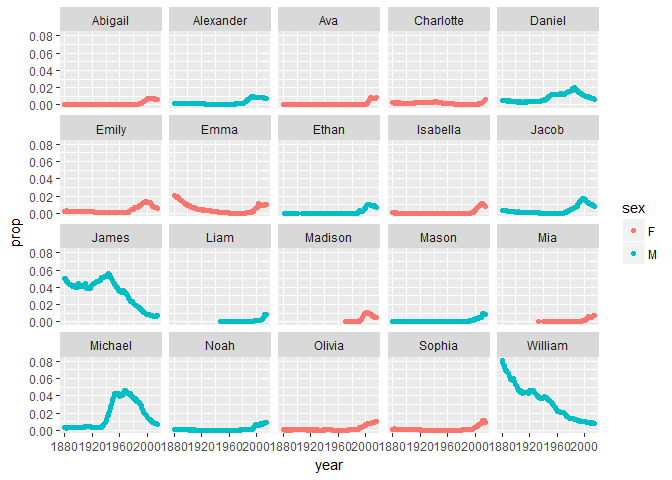
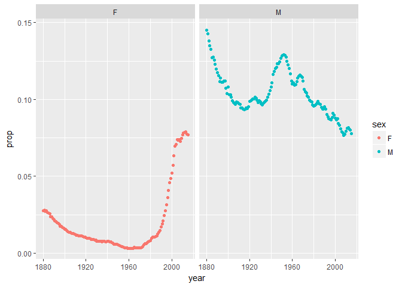
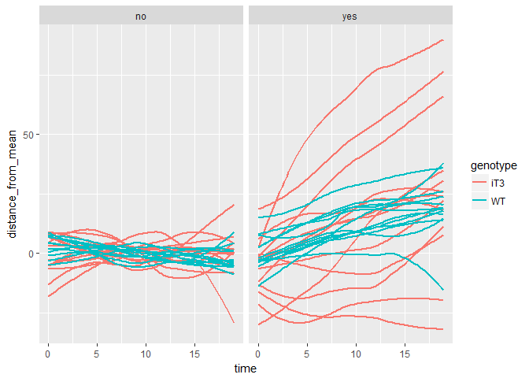

### NYCFlights13

Using the nycflights13::weather Determine whether there are any clear outliers in wind speed (wind\_speed) that should be rejected. If so, filter those bad point(s) and proceed. What direction has the highest median speed at each airport? Make a table and a plot of median wind speed by direction, for each airport.

``` r
library(tidyverse)
```

    ## Loading tidyverse: ggplot2
    ## Loading tidyverse: tibble
    ## Loading tidyverse: tidyr
    ## Loading tidyverse: readr
    ## Loading tidyverse: purrr
    ## Loading tidyverse: dplyr

    ## Conflicts with tidy packages ----------------------------------------------

    ## filter(): dplyr, stats
    ## lag():    dplyr, stats

``` r
library(outliers)
library(nycflights13)
library(babynames)
library(nasaweather)
knitr::opts_chunk$set(
  fig.path = '../plots/')
#Creates the dataframe 'median_windspeed'
median_windspeed<- weather %>%
  #Only these three columns are needed for analysis
  select(wind_speed, wind_dir, origin) %>%
  group_by(origin, wind_dir) %>%
  #outliers of wind_speed are removed using the outlier() function from the outliers package
  filter(wind_speed != c(outlier(wind_speed)), is.na(wind_dir) == FALSE) %>%
  #median wind speed is calculated for each airport and wind direction
  summarise(median_wind_speed = median(wind_speed, na.rm = TRUE))
print(median_windspeed)
```

    ## Source: local data frame [108 x 3]
    ## Groups: origin [?]
    ## 
    ##    origin wind_dir median_wind_speed
    ##     <chr>    <dbl>             <dbl>
    ## 1     EWR       10           9.20624
    ## 2     EWR       20           9.20624
    ## 3     EWR       30           9.20624
    ## 4     EWR       40           9.78163
    ## 5     EWR       50           8.05546
    ## 6     EWR       60           8.05546
    ## 7     EWR       70           6.90468
    ## 8     EWR       80           6.90468
    ## 9     EWR       90           5.75390
    ## 10    EWR      100           6.90468
    ## # ... with 98 more rows

``` r
#Wind Direction vs Median Wind Speed is plotted for each airport
median_windspeed_plot <- median_windspeed %>%
  ggplot(aes(wind_dir, median_wind_speed)) +
  geom_smooth() + geom_point() +
  facet_wrap(~origin) +
  labs(x= "Wind Direction", y = "Median Wind Speed")
print(median_windspeed_plot)
```

    ## `geom_smooth()` using method = 'loess'



Using nycflights13::flights and nycflights13::airlines Make a table with two columns: airline name (not carrier code) and median distance flown from JFK airport. The table should be arranged in order of decreasing mean flight distance.

``` r
#combines nycflights13::flights and nycflights13::airlines by the 'carrier' column
combined_flights_airlines <- left_join(flights, airlines, by = 'carrier')

distance_from_JFK <- combined_flights_airlines %>%
  #only planes leaving JFK
  filter(origin == 'JFK') %>%
  select(name, distance) %>%
  #median distance calculated for each airline
  group_by(name) %>%
  summarise(median_distance = median(distance)) %>%
  arrange(desc(median_distance))
print(distance_from_JFK)
```

    ## # A tibble: 10 × 2
    ##                        name median_distance
    ##                       <chr>           <dbl>
    ## 1    Hawaiian Airlines Inc.            4983
    ## 2     United Air Lines Inc.            2586
    ## 3            Virgin America            2475
    ## 4      Delta Air Lines Inc.            1990
    ## 5    American Airlines Inc.            1598
    ## 6           JetBlue Airways            1028
    ## 7           US Airways Inc.             541
    ## 8         Endeavor Air Inc.             427
    ## 9                 Envoy Air             425
    ## 10 ExpressJet Airlines Inc.             228

Make a wide-format data frame that displays the number of flights that leave Newark ("EWR") airport each month, from each airline

``` r
leaving_newark <- combined_flights_airlines %>%
  #Only planes leaving Newark, and only the origin, name, and month variables are required
  select(origin, name, month) %>%
  filter(origin == "EWR") %>%
  group_by(name, month) %>%
  #number_left is equal to the number of flights that have left EWR for each month and airline
  summarise(number_left = length(name))%>%
  #Creates a table with months for columns, airlines for rows.  Entries are the number of flights leaving EWR for each airline and month.
  spread(key = month, value = number_left)
print(leaving_newark)
```

    ## Source: local data frame [12 x 13]
    ## Groups: name [12]
    ## 
    ##                        name   `1`   `2`   `3`   `4`   `5`   `6`   `7`
    ## *                     <chr> <int> <int> <int> <int> <int> <int> <int>
    ## 1      Alaska Airlines Inc.    62    56    62    60    62    60    62
    ## 2    American Airlines Inc.   298   268   295   288   297   291   303
    ## 3      Delta Air Lines Inc.   279   249   319   364   377   347   340
    ## 4         Endeavor Air Inc.    82    75    91    88   103    88    94
    ## 5                 Envoy Air   212   196   228   220   226   218   228
    ## 6  ExpressJet Airlines Inc.  3838  3480  3996  3870  4039  3661  3747
    ## 7           JetBlue Airways   573   532   612   567   517   506   546
    ## 8     SkyWest Airlines Inc.    NA    NA    NA    NA    NA     2    NA
    ## 9    Southwest Airlines Co.   529   490   532   518   530   501   526
    ## 10    United Air Lines Inc.  3657  3433  3913  4025  3874  3931  4046
    ## 11          US Airways Inc.   363   328   372   361   381   390   402
    ## 12           Virgin America    NA    NA    NA   170   186   180   181
    ## # ... with 5 more variables: `8` <int>, `9` <int>, `10` <int>, `11` <int>,
    ## #   `12` <int>

Babynames
---------

Identify the ten most common male and female names in 2014. Make a plot of their frequency (prop) since 1880.

``` r
#dataframe of the ten most common male babynames of 2014
most_common_male <- babynames %>%
  filter(year == "2014", sex == "M") %>%
  arrange(desc(n)) %>%
  head(n=10)
#dataframe of the tne most common female babynames of 2014
most_common_female <- babynames %>%
  filter(year == "2014", sex == "F") %>%
  arrange(desc(n)) %>%
  head(n=10)
#combines most common male and most common female babynames of 2014 into one single dataset
common_names_2014 <- full_join(most_common_male, most_common_female)
```

    ## Joining, by = c("year", "sex", "name", "n", "prop")

``` r
#joins the initial babynames dataset with the most common names of 2014 by the 'name' and 'sex' columns
#This shows the frequency of 10 most popular male&female babynames of 2014 since 1880
common_frequency <- semi_join(babynames, common_names_2014, by = c('name', 'sex'))

#A plot of the individual frequency of the ten most common male&female baby names of 2014
all_names_frequency_plot <- common_frequency %>%
  ggplot(aes(year, prop, color = sex)) + geom_point() + facet_wrap(~name)
print(all_names_frequency_plot)
```



``` r
#The total frequency of the 10 most popular male&female names of 2014 was summed for each year
prop_combined <- common_frequency %>%
  group_by(year, sex) %>%
  summarise('prop' = sum(prop))
#A plot of the combined frequency of the 10 most common male and female babynames of 2014 over time
prop_plot_combined <- prop_combined %>%
  ggplot(aes(year, prop, color = sex)) + geom_point() + facet_wrap(~sex)
print(prop_plot_combined)
```



It appears that common female babynames in recent years were significantly less common 50+ years ago. On the other hand, the most common male babynames were actually more common in the past than they are now,

Make a single table of the 26th through 29th most common girls names in the year 1896, 1942, and 2016

``` r
common_girl_26to29 <- babynames %>%
  #only girls names from 1896, 1946, and 2014
  filter(year ==  1896 | year == 1946 | year == 2014, sex == 'F') %>%
  group_by(year) %>%
  #most common first
  arrange(desc(n)) %>%
  #26th to 29th names
  slice(26:29) %>%
  select(year, name)
print(common_girl_26to29)
```

    ## Source: local data frame [12 x 2]
    ## Groups: year [3]
    ## 
    ##     year     name
    ##    <dbl>    <chr>
    ## 1   1896   Martha
    ## 2   1896   Esther
    ## 3   1896  Frances
    ## 4   1896    Edith
    ## 5   1946   Gloria
    ## 6   1946   Cheryl
    ## 7   1946     Joan
    ## 8   1946  Marilyn
    ## 9   2014 Brooklyn
    ## 10  2014     Lily
    ## 11  2014   Hannah
    ## 12  2014    Layla

Write task that involves some of the functions on the Data Wrangling Cheat Sheet and execute it. You may either use your own data or data packages

The imported data frame contains the distance of the nucleus relative to the tip of a growing root hair at one minute intervals over twenty minutes, before and after treatment with oryzalin.

``` r
#imports root hair data.
roothairdata <- read_csv("../data/2017_4_6_complete_dataset.csv", col_names = TRUE) %>%
  #combines ID and root_hair number columns to create a combined, more descriptive root hair ID (rh_ID)
  unite(rh_ID, ID, root_hair, sep = "_")
```

    ## Parsed with column specification:
    ## cols(
    ##   ID = col_character(),
    ##   genotype = col_character(),
    ##   root_hair = col_character(),
    ##   oryzalin_treated = col_character(),
    ##   time = col_integer(),
    ##   nuc_to_tip_length = col_double(),
    ##   tip_growth = col_double(),
    ##   root_hair_length = col_double()
    ## )

``` r
#calculates the mean distance of the nucleus from the root hair tip over 20 minutes before oryzalin treatment for each root hair
nucmeans<- roothairdata %>%
  filter(oryzalin_treated == 'no') %>%
  group_by(rh_ID) %>%
  summarise(mean_nuc_distance = mean(nuc_to_tip_length)) #%>%
#rejoins nucmeans with original data set to compare pretreatment mean nuc distance to nuc distances at each time point
newhairdata<-left_join(roothairdata, nucmeans, by = 'rh_ID') %>%
  group_by(rh_ID, oryzalin_treated) %>%
  mutate(distance_from_mean = nuc_to_tip_length - mean_nuc_distance) 
#one data set for pretreatment
pretreatment <- newhairdata %>%
  filter(oryzalin_treated =="no")
#one data set for posttreatment
posttreatment <- newhairdata %>%
  filter(oryzalin_treated =="yes")
#plots position of nucleus at each time point, relative to the pre-treatment mean position of that nucleus
treatmentplot <- 
  ggplot() + 
  geom_smooth(data = pretreatment, aes(x = time, y = distance_from_mean, group = rh_ID, color = genotype), se = FALSE) + 
  geom_smooth(data = posttreatment, aes(x = time, y = distance_from_mean, group = rh_ID, color = genotype), se = FALSE) +  
  facet_wrap(~oryzalin_treated)
print(treatmentplot) 
```

    ## `geom_smooth()` using method = 'loess'

    ## `geom_smooth()` using method = 'loess'

 Each line represents the position of one nucleus over time.
0 is the pre-treatment mean distance for each line At each time point, the y-value is equal to the distance of the nucleus from the tip MINUS the pre-treatment mean distance When iT3 is treated with oryzalin, the variability in nuclear position increases more significantly than in WT.
